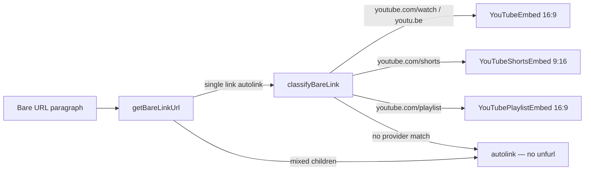

## What's new

Any markdown file rendered through `@lossless-group/lfm` now detects **bare URLs** — a URL that occupies an entire paragraph by itself, with blank lines above and below — and replaces them with the right embedded player. YouTube videos, Shorts, and Playlists each route to a dedicated component with theme parity.

Authoring is just:

```markdown
content line content line

https://youtu.be/jCe2wg1ulus?si=oplqTdsbv8sv2JfH

content line content line
```

→ renders as a 16:9 embedded YouTube player. Shorts URLs become a vertical 9:16 player; playlists become a 16:9 playlist player. Inline links (e.g. `Check this out https://youtu.be/...` mid-sentence) stay as plain autolinks — the detector requires the paragraph to have **exactly one child** that's a `link` whose visible text equals its URL.



## Classifier

- **`src/lib/markdown/classify-bare-link.ts`** — pure classifier with two exports:
  - `getBareLinkUrl(node)` — returns the URL if the MDAST paragraph is the bare-URL shape (single autolink child), else `null`. CommonMark's paragraph rule does the blank-line gating for free.
  - `classifyBareLink(url)` — runs the URL through ordered matchers (Shorts before Playlist before Watch), returns `{ provider, component, kind, id, url }` on first hit, `null` on no match.
- Matchers are the runtime mirror of the canonical catalog at `packages/lfm/src/plugins/Bare-Link-Provider-Catalog.md` — when the LFM `remark-bare-link` plugin lands, this site-local file is replaced by classification at parse time.

## Components

Three components copied from `lossless-monorepo/site/src/components/markdown/` and re-themed to mpstaton-site's semantic tokens:

- **`src/components/markdown/YouTubeEmbed.astro`** — 16:9 horizontal player. Captures `youtu.be/{id}` and `youtube.com/watch?v={id}` shapes (the existing internal Shorts branch is retained for callers that pass a Shorts URL directly, but bare-link classification routes those to the dedicated component).
- **`src/components/markdown/YouTubeShortsEmbed.astro`** — centered 9:16 player, max-width 320, polished caption block, bordered with the brand-aqua accent.
- **`src/components/markdown/YouTubePlaylistEmbed.astro`** — 16:9 playlist player. The `list` query parameter is the playlist ID; individual `v` parameters are ignored at classification time.

All three preserve the original `caption` prop and copy-URL button. The button now uses the same aqua-bordered hover treatment shared with the Mermaid expand/close buttons. `var(--card)` / `var(--border)` / `var(--foreground)` with sensible hex fallbacks replaced the original `rgba(255, 255, 255, 0.05)` baked-in surfaces.

## Renderer dispatch

- **`src/components/markdown/AstroMarkdown.astro`** — the `type === "paragraph"` branch now first asks `getBareLinkUrl(node)` then `classifyBareLink(url)` and dispatches to the matched component before falling through to a normal `<p>`. Single dispatch, three component arms.

## Catalog (canonical, lives in LFM)

- **`packages/lfm/src/plugins/Bare-Link-Provider-Catalog.md`** (in the parent astro-knots repo) — the source of truth for which URLs the bare-link plugin recognizes. Frontmatter is the record (provider entries with matchers, named-capture regexes, target component, kind, aspect ratio); the body explains how the parser reads it and how to extend it. Three providers `stable` today (YouTube watch / short / playlist), four `planned` (Vimeo, Loom, Spotify, SoundCloud).
- **Spec section §4.12** of `Codifying-a-Comprehensive-Extended-Markdown-Flavor-and-Shared-Package.md` updated: precise platform table now points at the actual existing component names, both Tier-A (bare) and Tier-B (explicit `:::directive`) share a single directive name per provider so renderers register one dispatch arm per provider not two, and the boundary between bare-URL embedded players and inline `LinkPreview__*--Row/Card/Thumb` previews is called out explicitly so the next implementer doesn't conflate them.

## Test content

- **`src/content/promote/_demo/memo/v1.md`** — added a bare `https://youtu.be/jCe2wg1ulus?si=...` URL between the intro and the `## Why now` heading. Reachable at `/promote/_demo/memo/version-1` for end-to-end verification of the classification + dispatch + theme parity.

## Why this lives in render-time today (and not in LFM yet)

Same motion as Mermaid: develop the pattern in `mpstaton-site` first, prove it on real content, then port the canonical version to `packages/lfm/src/plugins/remark-bare-link.ts` and `packages/lfm-astro/components/`. The catalog markdown file already lives in `packages/lfm/src/plugins/`, so the plugin work is "wire the parser to consume the catalog the renderer already mirrors."

## Pre-existing astro check noise

`pnpm astro check` reports 8 type errors on this branch — all pre-existing, none introduced by this work. Documented in `astro-knots/context-v/issue-resolution/Astro-Check-Type-Errors-on-mpstaton-site.md` with a recommended fix order. The build (`pnpm build`) passes cleanly; Vercel deploys are unaffected.
