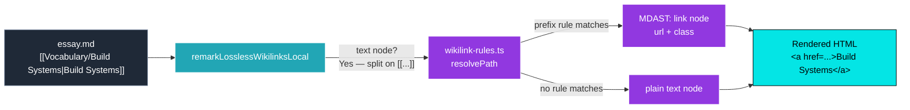
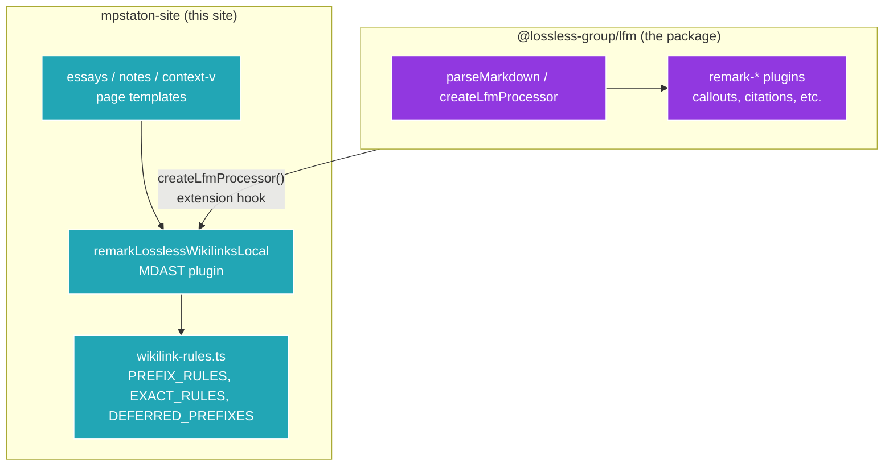

*Obsidian wikilinks have been leaking through the markdown pipeline as raw `[[...]]` syntax since the day we started importing essays. As of this evening, 208 of 354 unique wikilink paths resolve to live hyperlinks — purple in light mode, brand-aqua in dark — and the unresolved ones recede into the prose without leaving a trace.*

## Why Care?

The essays in this site are imported from a sibling Obsidian vault. Obsidian's vault uses `[[Vocabulary/Build Systems|Build Systems]]` and `[[Tooling/Software Development/Developer Experience/DevTools/Bazel]]` as a first-class authoring format — wikilinks are how the vault stitches together. Standard Markdown doesn't know about them. So when those essays got pushed through `parseMarkdown()` and rendered to HTML, the wikilinks rendered as literal text, square brackets and all. Reader sees `[[Vocabulary/Polyrepo|Polyrepo]]` in the middle of a paragraph and thinks "broken site."

Today's work makes them work. Not all of them — about 59% — but the system that resolves the 59% degrades gracefully on the rest. Operating principle: **supporting 40% of the intended wikilinks is better than supporting none.** Unresolved paths render as plain prose so the reader sees an ordinary word; the audit report (`[[Wikilink-Path-Audit__mpstaton-site]]`) tracks what's left.

The end-to-end flow:



## What's New?

- **An MDAST plugin lives at `src/lib/remark-lossless-wikilinks-local.ts`.** It walks `text` MDAST nodes only, splitting each match into pre+link+post nodes, replacing the original text node in place. **It skips code fences, inline code, and HTML naturally** — wikilink syntax inside a code block stays literal.

- **A rules-driven resolver at `scripts/wikilink-rules.ts`** is the single source of truth for which wikilinks point where. Three rule shapes:
  - `PrefixRule` — most common. `'tooling/'` → `lossless.group/toolkit/{slug}`.
  - `ExactRule` — one-off overrides. None active yet.
  - `DeferredRule` — deliberately parked prefixes (`organizations/`, `vertical-toolkits/`) that have no public destination yet. They render as plain text but don't pollute the "untouched" backlog.

- **Seven prefix rules** resolving 208 of 354 unique paths:

  | Prefix | Destination | Resolves |
  |---|---|---|
  | `tooling/` | `lossless.group/toolkit/{slug}` | 77 |
  | `concepts/` | `lossless.group/more-about/{slug}` | 48 |
  | `vocabulary/` | `lossless.group/more-about/{slug}` | 41 |
  | `projects/` | `lossless.group/projects/gallery/{slug}` | 24 |
  | `essays/` | `/essays/{slug}` (LOCAL) | 11 |
  | `sources/` | `lossless.group/sources/{slug}` | 6 |
  | `lost-in-public/` | `lossless.group/learn-with/{slug}` | 1 |

- **Three page templates wired** to call `createLfmProcessor().use(remarkLosslessWikilinksLocal, stats)` instead of `parseMarkdown()`: essays, notes/from-the-rabbit-hole, context-vigilance. The plugin is the same shape across all three; only the slug variable differs.

- **A `--prose-link` semantic token in `src/styles/tokens.css`.** Light mode keeps brand-purple; dark mode shifts to brand-aqua so the reader-attention layer (links + info-callout accents) reads as one coherent chromatic family. `prose.css` reads from `--prose-link` instead of `--primary` directly. Two-tier discipline preserved — components don't reference brand colors, only semantic tokens.

- **An audit report at `context-v/plans/Wikilink-Path-Audit__mpstaton-site.md`** (3700+ lines, regenerated on demand by `pnpm audit-wikilinks`). Every unique wikilink path gets a YAML entry: status (resolved / deferred / unresolved), resolved_url, occurrences, file references. The report is a *projection* of rules + content, so adding a rule = ~6 lines in `wikilink-rules.ts` + one re-run; the audit doc updates automatically.

## How It's Wired

The page template diff is small enough to show in full:

```ts
// BEFORE: src/pages/essays/[...slug].astro
import { parseMarkdown } from '@lossless-group/lfm';

const tree = await parseMarkdown(entry.body);
```

```ts
// AFTER: same file
import { createLfmProcessor } from '@lossless-group/lfm';
import {
  remarkLosslessWikilinksLocal,
  type WikilinkPluginStats,
} from '../../lib/remark-lossless-wikilinks-local';

const wikilinkStats: WikilinkPluginStats = {
  resolved: 0,
  unresolved: [],
  deferred: 0,
};
const processor = createLfmProcessor()
  .use(remarkLosslessWikilinksLocal, wikilinkStats);

const parsed = processor.parse(entry.body);
const tree = await processor.run(parsed);

if (import.meta.env.DEV && wikilinkStats.unresolved.length > 0) {
  console.log(
    `[wikilinks] ${slug}: ${wikilinkStats.resolved} resolved, ` +
    `${wikilinkStats.unresolved.length} unresolved`
  );
}
```

The rules file is even simpler — adding a destination is six lines:

```ts
// scripts/wikilink-rules.ts
export const PREFIX_RULES: PrefixRule[] = [
  // …existing rules…
  {
    prefix: 'newprefix/',
    template: 'https://www.lossless.group/somewhere/{slug}',
    destinationLabel: 'Lossless Somewhere',
  },
];
```

Re-run `pnpm audit-wikilinks` and every wikilink under `newprefix/` flips from `unresolved` to `resolved`. Anything matching no rule renders as plain text per the operating principle — no broken-link UI, no red squigglies, no reader-visible failure mode.

## The Two-Layer Architecture



LFM owns the *syntax processing*: wikilink regex, MDAST visitor, "produce a `link` node from a `[[...]]` match." None of that is site-specific.

The site owns the *destination decisions*: which prefixes route where, what counts as local vs external, which prefixes are parked. None of *that* is LFM's business.

The contract between them is a function signature — `resolvePath(lowercasedPath) → { url, rule } | null` — that the plugin calls once per matched wikilink. The LFM plugin doesn't care what the rules are; the site doesn't care how the parser works. Both halves stay small.

## A Real Example, End to End

The essay `from-engineering-to-managing-large-codebases.md` contains this paragraph:

> The success of monorepo strategies depends heavily on sophisticated `[[Vocabulary/Build Systems|Build Systems]]` capable of managing the complexity and scale involved. `[[Tooling/Software Development/Developer Experience/DevTools/Bazel]]` has potential.

After today's work, the rendered HTML for that paragraph reads:

```html
<p>
  The success of monorepo strategies depends heavily on sophisticated
  <a class="wikilink wikilink--external"
     target="_blank" rel="noopener noreferrer"
     href="https://www.lossless.group/more-about/build-systems">Build Systems</a>
  capable of managing the complexity and scale involved.
  <a class="wikilink wikilink--external"
     target="_blank" rel="noopener noreferrer"
     href="https://www.lossless.group/toolkit/software-development/developer-experience/devtools/bazel">Bazel</a>
  has potential.
</p>
```

Both anchors get the prose-link color treatment from `prose.css` — purple in light mode, aqua in dark — plus the underline and hover transition. External wikilinks open in a new tab; local ones (when the resolver returns `isLocal: true`, e.g. `essays/`) stay in-tab.

## What's Still Unresolved

102 paths remain — most are bare wikilinks (`[[Polyrepo]]` with no path prefix). These are intentional non-resolutions: they're legacy artifacts from before an Obsidian vault setting was enabled, and they point at "stub files" sitting at the vault root that haven't been organized into a folder yet. The audit report has a top-of-doc section listing every one of them with a triage path: open in Obsidian, move the stub into a folder, let Obsidian auto-update the wikilink syntax. Or accept the prose rendering and move on.

The audit infrastructure makes this triage incremental and visible. Re-running `pnpm audit-wikilinks` regenerates the report deterministically; resolution decisions live in `wikilink-rules.ts`, not in the audit doc, so the doc can be regenerated without losing manual work.

## What's Coming

The site-local plugin (`src/lib/remark-lossless-wikilinks-local.ts`) is a Phase-0 stopgap. The plan in `[[Wikilink-Resolution-System]]` ships the same plugin into `@lossless-group/lfm` as `remarkLosslessWikilinks` at LFM 0.3.0. When that lands, this site changes one import line, deletes the site-local plugin file, and the resolver options move into `parseMarkdown(content, { wikilinks: ... })`. The rule shapes in `wikilink-rules.ts` migrate verbatim — they were built to match the canonical interfaces from day one.

In the meantime, every additional rule we author in `wikilink-rules.ts` is permanent: when the LFM plugin lands, those rules graduate into a proper `src/config/wikilinks.ts` module without any reshaping. Today's incremental progress sticks.

## Related

- `[[lfm/2026-05-08_02]]` — the supporting-feature side: how `createLfmProcessor()` enabled this work without an LFM release.
- `[[Wikilink-Resolution-System]]` — the plan that codified the architecture before any code was written.
- `[[Wikilink-Path-Audit__mpstaton-site]]` — the live worklist (regenerated by `pnpm audit-wikilinks`).
- The earlier ship today, `[[2026-05-08_01]]` — the LFM Callout system integration. Same authoring stack; different feature.
