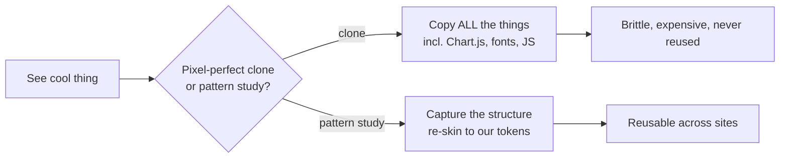

# A New Content Paradigm — The Scroll Report

## Why Care?

Long-form research, market reports, and thesis-grade essays don't render well as ordinary blog posts. They flatten. The KPIs lose their punch, the section transitions disappear, the reader scrolls past the part you cared about most.

A few months back we built **Scroll Decks** for the calmstorm-decks fundraise workspace — a narrative-as-presentation pattern. This entry introduces the **Scroll Report**: the same lineage, reshaped for *research* instead of *pitch*. Think of it as the visual mode for things like a State-of-the-Industry report, an annual survey, a deep-dive thesis, or a heavily-figured argument essay. Each section gets its own gradient palette. The page literally changes color underneath you as you read through the argument. Stats become full-bleed visual moments instead of inline numbers.

For mpstaton-site (and Astro Knots more broadly), this is a third top-shelf content paradigm sitting alongside posts and essays. For clients we'll eventually build for, it's a ready-to-clone pattern when the brief is "we have a 30-page report, make people actually read it."

## What's New?

- A new demo page at **`/demo/scroll-reports/genai-security`** showcasing the full pattern, with content sourced from Lakera's published *2025 GenAI Security Readiness Report* (linked, credited, `noindex`).
- Ten narrative sections with **per-section theme transitions** — body class swaps via `IntersectionObserver`, so the gradient palette under the page literally shifts as the reader moves between *Preface → Summary → Risks → Outlook*, etc.
- A **side-nav dot rail** (right edge, desktop only) with tooltips and a glowing active-state, plus a sticky top nav and a mobile hamburger drawer.
- **KPI cards, stat cards with split layouts, gradient-text emphasis, animated hero haze, a 2×2 quadrant chart, and a 2024-vs-2025 comparison grid** — all scoped, all in pure CSS + Astro, no chart libraries.
- **Charts without Chart.js**: pies are CSS `conic-gradient` donuts, bars are CSS-grid + animated `--w` width fills. Same data fidelity, ~zero JS payload.

## The Story

The trigger was a single URL. A "look at this!" link to Lakera's GenAI Security report — striking enough to stop the scroll, novel enough to file under "we should be able to do this." It's the kind of artifact that makes you want to redesign your own publication strategy.

The decision tree on rebuilds like this is always the same:



We chose the second path. The whole point of an Astro Knots pattern is that next quarter, when a client says *"we have a thesis report and want it to feel like a product"*, we don't curl-and-rebuild — we duplicate this page, swap the copy and palette, and ship.

A few choices worth flagging for next time:

- **Self-contained `<html>` shell, no `BaseLayout`.** The dark gradient canvas fights any site chrome that tries to sit on top of it. For Scroll Reports specifically, the report *is* the chrome.
- **No Tailwind preflight on this page.** Scoped `<style is:global>` block instead. Preflight's list/heading resets fight the typography moves the pattern depends on.
- **Charts in pure CSS.** A `conic-gradient` donut with five wedges is ~10 lines of CSS plus a few CSS variables; the equivalent Chart.js pie is a 200KB dependency for a static infographic. The math (cumulative percentage thresholds) lives in the CSS itself via `calc()`.
- **Section themes via `IntersectionObserver`**, not scroll-position math. Cheaper, more correct on resize, and the rootMargin trick (`-30% 0px -50% 0px`) lets us pick the section closest to the *visual* center, not the geometric one.

The whole thing landed in a single self-contained `.astro` file. Roughly 20 minutes of curl-and-read on the source, the rest building.

## How It Works (or "Under the Hood")

The signature move is per-section theme transitions. Every section declares the gradient it wants:

```astro
<div data-theme="theme-summary" data-section-id="summary" class="report-section">
  ...
</div>
```

CSS defines what each theme means:

```css
body.theme-summary { --current-grad-start: #00AEEF; --current-grad-end: #00DFD8; }
body.theme-risks   { --current-grad-start: #E6007E; --current-grad-end: #f59e0b; }
/* every gradient-using element reads var(--current-grad-start/end) — */
/* highlights, stat-card accents, list bullets, the page background haze */
```

A single `IntersectionObserver` swaps the body class as the user scrolls:

```js
const observer = new IntersectionObserver((entries) => {
  const visible = entries.filter(e => e.isIntersecting)
    .sort((a, b) => a.boundingClientRect.top - b.boundingClientRect.top);
  if (!visible.length) return;
  const top = visible[0].target;
  setBodyTheme(top.getAttribute('data-theme'));
}, { rootMargin: '-30% 0px -50% 0px' });
```

Charts are CSS-only:

```css
.donut {
  background: conic-gradient(
    var(--c1) 0%       calc(var(--p1) * 1%),
    var(--c2) calc(var(--p1) * 1%) calc((var(--p1) + var(--p2)) * 1%),
    /* ... */
  );
}
```

```html
<div class="donut" style="--c1:#4f46e5;--c2:#8b5cf6;--p1:35;--p2:28;..."></div>
```

That's the whole pie chart engine. Bars use a similar trick with a `--w` width custom property animated via `@keyframes`.

## What's Next

A few directions, in rough priority:

1. **Promote the pattern out of `/demo/`** — once a real piece of long-form content exists, give it a permanent home. Likely `/reports/<slug>` or similar.
2. **Extract to `@knots/astro` as a copy-paste pattern**, alongside the existing markdown components. Not a published runtime dependency — a reference implementation other sites duplicate and re-skin. Sibling sites get a head start.
3. **Wire it to LFM and content collections** so the long-form copy can live in MDX/MD with frontmatter-driven section themes, KPIs, and stat-card props. Right now the demo is hand-authored JSX. The endgame is markdown-first authoring with the scroll-report shell rendering around it.
4. **A "Scroll Brief" sibling** — same chassis, shorter narrative, single-screen-per-section. Closer in spirit to the calmstorm-decks slide variants, with the report's editorial voice.

The bigger story: mpstaton-site is becoming the Astro Knots pattern lab. Whatever shape long-form content wants to take next, this is where it gets prototyped first.

## Related

- [Lakera's 2025 GenAI Security Readiness Report](https://www.lakera.ai/genai-security-report-2025) — the inspiration
- [[calmstorm-decks]] — the Scroll Deck sibling pattern in the fundraise workspace
- [[Build-a-Fundraise-Deck-Workspace]] — the deck pattern's blueprint, instructive sibling for an eventual Scroll-Report blueprint
- [Live demo](/demo/scroll-reports/genai-security) (local: `pnpm dev` then visit the URL)
