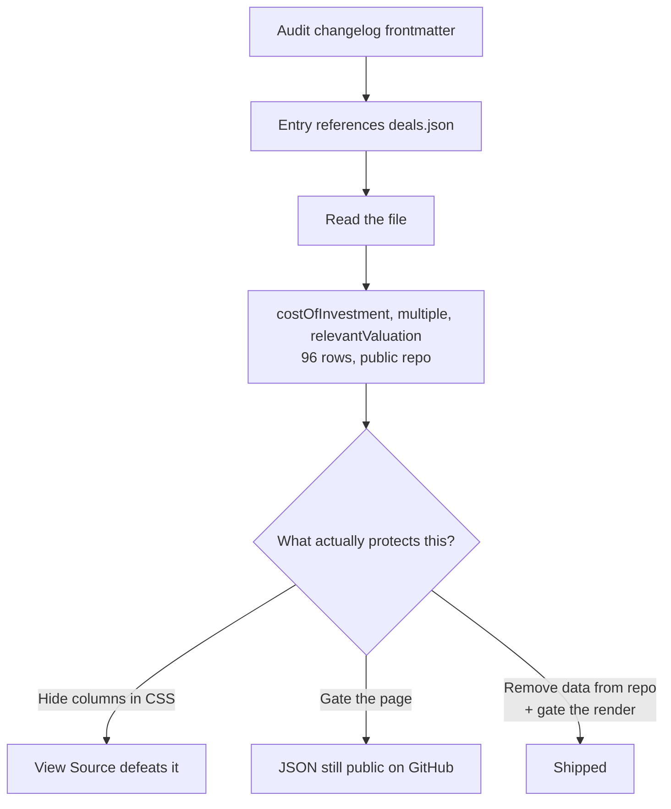

# A passcode for the right-hand columns

## Why Care?

A track record is a credibility document. It only works if people can see it — which is why the portfolio table has been public since March, listing 96 deals across 90 companies with the sectors, stages, years, and outcomes attached.

But two of those columns were never really ours to publish. **Multiple** is arguably fair game — plenty of angels publish theirs. **Valuation** is the company's number, not the investor's, and for 23 of these companies it was sitting on a public page in the $260M–$1.1B range.

So the table is now split down the middle. Everything that makes the track record legible — company, vehicle, country, sector, year, stage, exit, tags, and the cost of investment — stays public. The two markup columns ask for a passcode. If you want them, you ask, and you get seven days on that device.

The interesting part isn't the passcode. It's that **the gated numbers are no longer in the repository at all** — so there is nothing to find by viewing source, reading the JSON on GitHub, or poking at the build output.

## What's New?

- **A two-tier table.** `Multiple` and `Valuation` render as muted `•••` with a 🔒 in the header until unlocked. Every other column is unchanged.
- **A prompt that sits with the tag pills** — a muted box alongside IPO / Unicorn / Dragon / Exit reading *"Ask Michael for passcode to see more confidential information."* Type the code there, no separate page.
- **Seven-day sessions**, HttpOnly + SameSite=Lax + Secure, scoped to `/portfolio`, with a `Lock` control to hand the session back.
- **The figures left the repo.** `deals.json` and `funds.json` keep the public columns and gained a stable `id`; the markups live in a gitignored file, joined back by that `id` at render time. Production reads them from an environment variable, because a gitignored file never reaches the builder.

## The Story

This started as a changelog audit. The task was to check `changelog/` against our own conventions — the frontmatter standard, the `Why Care? / What's New?` shape, the lede rules. Eight entries were missing `publish`, `lede`, `authors`, and `augmented_with`, so those got backfilled.

Then, tracing where one entry's claims pointed, the audit wandered into `src/data/track-record/` and found `relevantValuation` populated on 23 rows of a file committed to a public repo.

That reframed the afternoon.



The first instinct — hide the columns — is wrong, and wrong in a way worth writing down. The sort feature emitted every multiple as a `data-multiple` attribute on each row so the client could sort without a round trip. **A CSS rule hiding the cells would have left all 96 values sitting in the DOM.** Anything that renders and then conceals is theatre.

The second instinct — gate the page — is also wrong, just less obviously. The numbers were in a JSON file in a public repository. A gate on the page does nothing about a file anyone can read on GitHub.

Which leaves the only version that actually holds: **the data has to be absent from what you publish, and the render has to be server-side.** Everything else was downstream of accepting that.

## How It Works

The split is by `id`, minted once and stable:

```json
// deals.json — committed, public
{ "id": "nearpod-2012", "company": "NearPod", "sector": "Edtech",
  "initialInvestmentDate": 2012, "costOfInvestment": 300000,
  "stage": "Seed", "exit": "Acquired", "tags": ["Dragon", "Exit"] }
```

```json
// private/markups.json — gitignored, never committed
{ "deals": { "nearpod-2012": { "multiple": "…", "relevantValuation": … } } }
```

Company name alone wasn't a safe key: three companies have multiple investments, and `(company, year)` collided on exactly those three. An explicit `id` survives row insertion and reordering, which matters because this table gets appended to.

The gate is a deliberate sibling of the existing `/promote` gate rather than a refactor of it — its own cookie, path, salt, and code, so a change to one can't silently widen the other. Holding a `/promote` session does not unlock markups. One departure: its dev bypass is honoured **only** under `astro dev`, so a stray `=1` in a production environment can't open the surface.

The page never assembles what it shouldn't send:

```astro
const showMarkups = Astro.locals.trackRecordMarkups?.unlocked === true && hasMarkups();
const markups = showMarkups ? loadMarkups() : { deals: {}, funds: {} };
```

```astro
<td>{showMarkups ? markups.deals[deal.id]?.multiple ?? '—' : <span>•••</span>}</td>
data-multiple={showMarkups ? parseFloat(…) || 0 : undefined}
```

Plus `Cache-Control: private, no-store` and `Vary: Cookie`, so a CDN can't hold one unlocked render and hand it to everyone.

Verified against a running server rather than by reading the code: a locked response contains zero multiples, zero valuations, and zero `data-multiple` attributes; a wrong passcode sets no cookie; and the production build output carries no markup values anywhere.

## What's Next

The pattern generalises. Any Astro Knots table with a public half and a private half can take this shape: split the fields out of the committed data, join by a stable id, gate server-side, and let the locked state advertise itself rather than pretend the columns don't exist. It probably wants to become a blueprint once a second site needs it.

The nearer thing is a spec for **what belongs in a public track record at all**. "Multiple is ours, valuation is theirs" is the line drawn here, and it was drawn in the moment rather than from a policy. Writing that down before the next data table gets built is cheaper than discovering it again.

## Related

- [[2026-05-03_01]] — the `/promote` gate this one is modelled on
- [[Build-a-Promotion-Surface-for-Investment-Opportunities]] — the blueprint for the sibling gated surface
- [[changelog-conventions]] — the audit that started this
