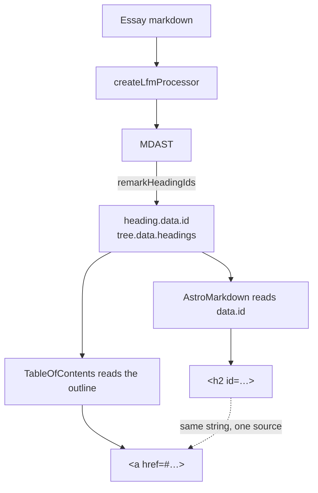

# Essays learn where you are

## Why Care?

The essays outgrew the scrollbar a while ago. *The Geography of Innovation* runs to thirty-nine navigable sections. *Software Development with Code Generators* has thirty-four. These are read by scanning first and reading second, and until now the only affordance for that was the scrollbar thumb.

The pieces to fix it already existed and nothing rendered them. LFM's `remarkHeadingIds` has been stamping every heading with a stable, deduped anchor and attaching an ordered outline at `tree.data.headings` — described in its own source as *"ready to render a table of contents."* This is that.

## What's New?

- **A reading-position ToC on every essay** that has at least three `h2`/`h3` sections. Twenty-five of fifty qualify; the other twenty-five render nothing, which is correct — a two-item outline is noise.
- **Three viewport states from one render.** A persistent rail at ≥1280px, a hamburger between 768–1279px, and a top bar below 768px whose label names the section you are currently reading. All three track position; selecting a heading collapses the panel; `Esc` and click-outside dismiss.
- **It works with JavaScript off.** It is a list of anchors. The tracking is enhancement.
- **The renderer stopped inventing anchors.** `AstroMarkdown` reads `node.data.id` now; its local slugify is gone.
- **A `/design-system/markdown` page** documenting the component, its props, and the reasoning — because a catalog that lags the code is worse than no catalog.

## The Story

The load-bearing decision here is where the outline comes from, and it rules out the two obvious shortcuts.

Markdown that documents markdown, shell, or Python is full of lines that look like headings and are not:

````markdown
```bash
# Install the package
pnpm add @lossless-group/lfm
```
````

That `#` line is a comment inside a fence. A regex over the raw text sees a heading. A `querySelectorAll('h2[id], h3[id]')` over the rendered page avoids that trap but falls into others: it can only see what the renderer emitted, so it cannot tell a `synthetic` id from a real one, cannot see a `duplicateOf` collision, and has to run client-side after paint.

`tree.data.headings` is built by walking the MDAST, where a fenced block is a `code` node and not a `heading` node. The problem cannot occur.



The awkward part was the swap itself. The renderer had its own slugify, so retiring it moves anchors — and moved anchors break links people have already shared. So it got measured before it shipped: parse all fifty essays, compute both slugs for all 394 headings, count the differences.

**Five moved out of 394.** All five were collisions the old algorithm had been producing silently — one essay carried four separate sections called *Traction Data:*, all four resolving to `#traction-data`, so three of them were unreachable. LFM disambiguates them. Every unique heading kept the anchor it already had.

## How It Works

Selection lives in one place, `src/lib/markdown/toc.ts`, because two callers need the same answer:

```ts
export function selectTocEntries(headings, { minDepth = 2, maxDepth = 3, excludeContainers } = {}) {
  return filterHeadings(headings, minDepth, maxDepth)
    .filter((h) => !h.inContainer || !excludeContainers.includes(h.inContainer));
}
```

`filterHeadings` handles the depth band and drops `synthetic` entries. The second filter is the site's own judgement: an `h3` inside a callout deserves an anchor but is an aside, not a waypoint. Across the essays that removes sixteen callout headings and four inside blockquotes.

The second caller is the page, and the reason is a bug worth recording. The rail is a 15rem grid column. Declare that grid unconditionally and the twenty-five essays with no ToC drop their article *into* the rail track, squashed to 15rem. So the page asks first:

```astro
const showToc = hasTableOfContents(headings);
```

and the grid only exists under `[data-has-toc]`. Component and layout can't disagree, because they call the same function.

**One deliberate departure from the fullstack-vc reference implementation.** That site pins its header, so its ToC is `position: fixed` beneath a known obstruction. This site's header scrolls away — a fixed bar would sit on the logo at rest, on top of the nav you'd need to leave with. Here the ToC is `position: sticky` in normal flow: below the header when you're at the top, pinned to the viewport once the header is gone. The measured `--lfm-toc-header-bottom` is still honoured, so pinning this site's header later needs no change to the component.

Everything the blueprint calls standard is standard: rendered from the parse tree, three states, tracking in all three, the collapsed trigger naming the current heading, selection collapsing the panel, no-JS anchors, `Esc` and click-outside, the three-entry floor, a measured header offset, and anchors that come from `data.id` rather than being recomputed.

Verified against a running server rather than by reading the code: all fifty essays return 200, the ToC appears on exactly the twenty-five the offline analysis predicted, the layout gate never disagrees with the component, and **every ToC link on the site resolves to a heading id that exists on its page** — zero dangling anchors.

## What's Next

Essays first because they are the longest thing here. The blueprint's own priority order puts `context-v` documents and changelog entries at the top, and both render through the same `AstroMarkdown` on this site, so they are the next two surfaces — the component and the selector are already shared.

The known blocker is upstream: a heading inside a container arrives in the outline indistinguishable from a document-level section except for `inContainer`, which is a container *name*, not a judgement about navigability. Excluding `callout` and `blockquote` is a guess that happens to be right for this corpus. A `:::details` block would be a genuine waypoint and would need adding back by hand.

## Also Included

Two fixes that surfaced while walking the essays surface, neither related to the outline:

**Dates now read like dates.** Five render sites across three collections were printing raw frontmatter ISO strings — *Updated 2026-06-19*. The house convention across astro-knots is long form: **June 19, 2026**. `src/utils/format-date.ts` is copied from fullstack-vc's `src/lib/format-date.ts` rather than reinvented, so the styles stay identical between sites. It formats in **UTC** deliberately: `2026-06-19` parses as UTC midnight, and formatting that in a negative-offset timezone renders June *18*. Each date is now wrapped in `<time datetime="…">` carrying the ISO value, so the machine-readable date survives even though the human-readable one changed — which matters on a site that publishes `llms.txt` and a sitemap.

The essays index, both notes surfaces, and the context-v detail page were fixed alongside the essay page, because a convention applied to one of five surfaces is not a convention.

**The essays index is sortable by Updated or Written.** Two pills above the list; clicking the active one flips direction. The axes are genuinely different orderings, not a cosmetic toggle — *AI is first a Trojan Horse* is the most recently updated essay and sits nowhere near the top by written date. The card's visible date follows the active sort, so the ordering is never unexplained: both dates are in the DOM and CSS shows the one that matches `data-sort`. Sort keys are emitted as ISO strings precisely so string comparison is the correct comparison. Nine dates on each axis are shared by more than one essay, so the title tiebreak is load-bearing rather than defensive. The control renders hidden and is revealed by the script — inert buttons are worse than absent ones, and the server-rendered order is already Updated-descending, which is where the control starts anyway.

**Essays show when they were written, not just when they were touched.** Every essay carries both dates and *none* of the 50 has them on the same day — the median gap between initial draft and last modification is 315 days, the widest is 651. *How Markdown Changed Everything* was drafted 2024-09-02 and last touched 2026-06-15, and an "Updated" line alone presented it as new writing. The meta row now reads **Written September 2, 2024 · Updated June 15, 2026**. `date_authored_initial_draft` covers 48 of 50; the other two fall back to `date_created`, which all 50 have, so the pair renders on every essay. This is essays-only — notes carry no authored date at all (0 of 4).

**Tags and categories lost their dashes.** Frontmatter authors them as `Near-Future-Anticipation` because Obsidian's tag syntax requires the dash form. That is an authoring-tool constraint and has no business reaching a reader, so `humanizeTerm()` strips it at render: **Near Future Anticipation**. 230 of the 330 distinct tags in this content carry at least one dash, so this was the common case. The stored value stays canonical — it is still the filter key on `/context-vigilance`, where the tab *label* is humanized and `data-filter` is not, because the client filter compares it against a raw `data-category`. Applied across essays, notes, context-v, DocCard, and the Content Farm plugin cards. Deliberately **not** applied to `Augment-It`, which is a product name matching the `augment-it` repo rather than a taxonomy term.

**Two stale facts on `/projects`.** The page advertised LFM at `v0.3.0`; JSR says `0.5.1`, which is also what this site has been pinned to. And the Astro Knots roster still named a spring lineup — the count is genuinely still twelve, but `calmstorm-decks` left the tree while Arthouse, LearnStart, FullStack VC, and the changelog roll-up arrived, so the sentence now names them.

**The build stopped warning about `Astro.request.headers`.** `/llms.txt` and `/llms-full.txt` are the only `prerender = true` routes here, and middleware runs for prerendered routes too — at build time, where there is no real request. The middleware exists solely to read session cookies, which a route baked at build time can never have, so it now returns early on `context.isPrerendered`. Both consumers of those locals already read them optionally, so an unset local reads as *locked* — the safe direction. Verified the `/portfolio` gate still renders 204 masked cells and zero `data-multiple` attributes.

## Related

- [[Standard-Table-of-Contents-for-Every-Markdown-Collection]] — the blueprint this implements
- [[Guarantee-Text-Wrapping-and-No-Horizontal-Bleed-at-Any-Width]] — the prerequisite; a ToC on a page that bleeds sideways gets the blame for it
- [[Maintain-Extended-Markdown-Render-Pipeline]] — where `AstroMarkdown` fits
