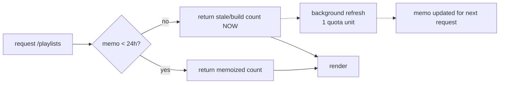

# Four playlists, one page, and a counter that stops lying between deploys

## Why Care?

The YouTube playlist component family shipped back in May — build-time fetcher, escape-positioned scroller, Svelte island wired to the IFrame Player API. It was good work with no front door. The only place it rendered was a context-v spec page that happened to quote a playlist URL as a worked example of bare-link resolution.

Meanwhile there are **6,362 videos** across four playlists collected over the years, and no way to look at them.

## What's New?

- **`/playlists`** — four curated playlists behind a tab toggle: Lossless Toolkit (2,683), Lossless Thinking (2,178), Tech Adjacent Possible (1,037), and Music Videos (464). Full `tablist` / `tab` / `tabpanel` semantics with arrow-key navigation, and the active tab reflected in the URL hash so a playlist is linkable.
- **A YouTube-icon Header link**, red on hover, after CV.
- **Figma and Substack join the socials row**, taking it from four icons to six.
- **`src/config/playlists.ts`** — the curated registry, which the build-time fetcher now reads alongside its content scraping.
- **Counts refresh on every build** for one quota unit, instead of freezing with the item cache for thirty days.
- **A runtime refresh layer** that keeps the number current between deploys with no rebuild, no commit, and no new services.

## The Story

Three things were wrong, and only the first was obvious.

**The fetcher could not see the page.** `discoverPlaylistIds()` walks `src/content/` for `youtube.com/playlist?list=` URLs. That is exactly right for a playlist an author pasted into a document, and useless for a curated page in `src/pages/` — the two new playlist IDs would have rendered in facade mode forever because no markdown file mentions them. Hence the registry: an ordered, labelled, explicit set that the fetcher seeds from before it scans content.

**The counter was frozen.** A full fetch of these playlists is expensive, which is why the cache carries a 30-day TTL:

```
3 playlists.list + 119 playlistItems pages + 119 videos pages  ~= 241 quota units
```

But that TTL anchored on `fetchedAt` froze the *counts* along with the item lists, so any build inside the window rendered a number up to a month old.

The fix is that `playlists.list` accepts comma-separated ids and costs **1 unit for the whole set**, regardless of how many playlists or how many thousands of videos they contain. So counts refresh on every build for a single unit while the expensive item list keeps its TTL. `refreshCounts()` deliberately does not touch `fetchedAt` — updating it there would reset the items TTL and the item lists would never refresh again. The new `countsFetchedAt` anchors the cheap refresh separately.

Verified by tampering rather than by assertion — the cache was edited to a wrong count and title, then the fetcher re-run:

```
~ Lossless Toolkit — 9999 → 2683 (-7316)
✓ 0 fetched, 4 skipped (items cache fresh), 0 failed;
  counts refreshed for 4 (1 changed), 6,362 videos total.
```

Items stayed cached. The TTL anchor was untouched.

**A cron job was the wrong tool, so one was not built.** The ask was a daily check that never rebuilds and never commits, and a Vercel cron looks like the answer until you ask where it writes. It fires a serverless function whose filesystem is read-only and discarded after the invocation. There is nowhere to put the refreshed number. Making cron work means adding KV or Blob storage — real infrastructure, a new failure mode, and a bill, for one integer.

This site is `output: 'server'`, so pages render per request. Refreshing in the request path gets the same outcome with nothing new to operate:



Reads never await the network. A slow or failing YouTube API can delay the *next* correct number; it can never delay or break a render. Cost is roughly one unit per warm instance per day against a 10,000/day tier.

`/api/playlist-counts` reports whether the layer is working and how old the number is, without reading logs — and doubles as the endpoint to ping if this should ever run on a real clock.

The live layer then demonstrated itself by accident. With a deliberately stale build cache it reported:

| Playlist | Build cache | Live | Source |
|---|---|---|---|
| Lossless Toolkit | 2,683 | 2,683 | live |
| Lossless Thinking | 2,178 | 2,178 | live |
| Tech Adjacent Possible | 1,037 | 1,037 | live |
| **Music Videos** | **0** | **464** | live |

Which is the whole feature in one row: a counter corrected between deploys, with no rebuild.

## How It Works

The key must be read from **both** env surfaces:

```ts
function env(name: string): string | undefined {
  return (import.meta.env as Record<string, any>)?.[name] ?? process.env[name];
}
```

Astro loads `.env` into `import.meta.env` and does not copy unprefixed keys into `process.env`; Vercel injects project env vars into `process.env` at runtime. A single-surface read silently reports "no key" in one environment or the other — which is exactly what the first version did, reporting `hasKey: false` in dev while looking perfectly correct.

One sizing trap worth recording. The scroller escape-positions into the right margin with:

```css
width: min(340px, calc(((100vw - 100%) / 2) - 2rem));
```

`100%` is the container. So a **wider** container produces a **narrower** scroller — the opposite of the intuition. At `max-w-5xl` the scroller collapses to 96px at a 1280px viewport; at `max-w-4xl`, the essay column the component was tuned against, it gets 160px. The page uses `max-w-4xl` for that reason and widening it would hurt.

All four embeds render server-side and the toggle swaps which panel is shown. The player iframes carry `loading="lazy"`, so a hidden panel costs markup but not a YouTube round trip, and switching is instant with no fetch and no layout jump.

## Also Included

**The socials row grew from four icons to six** — Figma (`figma.com/@mpstaton`) and Substack (`substack.com/@mpstaton`) alongside LinkedIn, X, GitHub, and Instagram. Same treatment as the existing four: 18×18, `fill="currentColor"`, muted by default, hovering to the service's brand colour where it has a recognizable one — `#F24E1E` for Figma, `#FF6719` for Substack, while X and GitHub keep going to plain foreground.

Those two brand oranges sit close together on the wheel. It reads fine because the marks are adjacent but silhouetted very differently, and it is worth knowing the constraint exists before a seventh icon lands nearby.

No version bump: this is a nav addition on top of the release above, not a release of its own.

One honest gap. The Substack profile was verified — `200`, page title `Michael Staton | Substack` — but **Figma blocks automated requests**, returning a 919-byte `403` with no HTML. The status codes it hands back say nothing about whether a profile exists, so that link went in unverified and wants a human click.

## What's Next

`YOUTUBE_API_KEY` is now set in the Vercel runtime environment, so the live layer is active on the deployed site — without it the page falls back to build-time counts, which are correct but frozen until the next deploy.

Two open questions the browser will answer faster than reasoning will: whether the escape-positioned scroller sits well on a dedicated page rather than inside prose, and whether switching tabs leaves the previous iframe playing audio. If it does, the fix is a `pauseVideo` postMessage on switch.

## Related

- [[2026-05-07_01]] — paste a playlist link, get a real playlist component
- [[2026-05-07_03]] — the v1 ship of the playlist embed family
- [[Versatile-Component-Library-for-Video-Players]] — the spec, and until now the only page that rendered one
