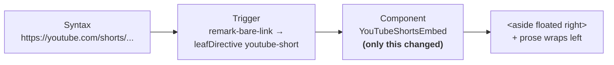
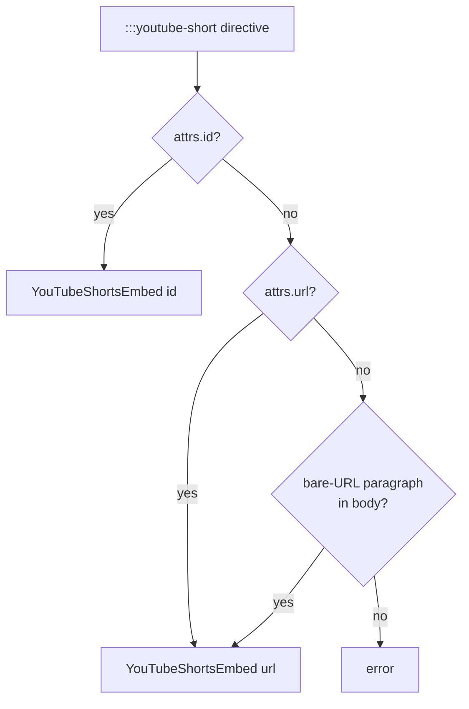

*A YouTube Short used to occupy a full row by itself — 320px of player surrounded by 700px of empty column. Now it floats. Prose wraps alongside, and a memo reads like a magazine instead of a slideshow.*

## Why Care?

Most authoring systems that get video right get it *too* right — players center themselves, take the full column, and shove the prose into a break around them. Defensible default for a 16:9 trailer. Wasteful default for a YouTube Short.

A Short is 9:16. At its native LFM rendering width — 320px max — it occupies less than half the column on a typical reading layout. Once it's well-styled (theme-token chrome, lazy iframe, mobile-friendly wrapper) the temptation is to call it done. But "done in isolation" is the wrong frame. **Done means done in the document flow you actually publish to** — and our document flow is investment memos, design notes, and long-form essays. None of those want a five-second clip stealing a full row of vertical space.

So the default for `YouTubeShortsEmbed` now floats. Paste a Shorts URL on its own line; prose around it wraps along its long edge. Margin floats have been the right answer for narrow editorial content since print magazines stopped being a fringe medium; this is just the markdown-native version of the same idea.

## What's New?

- **`YouTubeShortsEmbed` defaults to `<aside>` with `float: right`.** Authors do nothing different — bare-URL auto-unfurl still works. The component just renders as a float instead of as a centered block.
- **An `align` prop (`"left" | "right"`, default `"right"`).** The directive form `:::youtube-short{align="left"}` hands it through (see "Directive form" below); bare URLs get the default.
- **Mobile breakpoint drops the float and re-centers.** Below 640px the prose column gets too narrow for a side-by-side, so the layout falls back to the centered-alone rendering — the original "perfect in isolation" treatment, used only when the layout actually demands isolation.
- **The demo memo got prose around its Shorts URL.** `src/content/promote/_demo/memo/v1.md` now narrates the LFM video-player journey in 600 words of paragraphs wrapped around its Shorts. The wrap is visible end to end, not just at the top of the float.
- **The directive form `:::youtube-short` is wired with a versatile dispatcher.** Authors can write the directive three ways and the renderer figures out the rest: `id` attribute, `url` attribute, or — most realistic — paste the bare URL inside the container body. The component accepts either `id` or `url` and parses the ID itself when needed.

### Before / After

| | Before | After |
|---|---|---|
| Shorts on its own line | Centered block, full row | `<aside>` floated right |
| Prose adjacent to it | Pushed below the player | Wraps to the left of the player |
| Mobile (≤640px) | Centered, max-width 280px | Centered, max-width 280px (unchanged) |
| Author API | Just paste the URL | Just paste the URL |
| Override side | n/a | `align="left"` (when the render path forwards it) |

## How it works

The bare-link plugin still classifies the Shorts URL the same way and `AstroMarkdown.astro` still dispatches to `YouTubeShortsEmbed`. The only thing that changed is the outermost wrapper of the component itself:

```diff
-<div class="youtube-shorts-container">
+<aside class={`youtube-shorts-aside youtube-shorts-aside--${align}`}>
   <div class="youtube-shorts-wrapper">
     <iframe … />
   </div>
   …
-</div>
+</aside>
```

…paired with a small block of CSS that does all the work:

```css
.youtube-shorts-aside--right {
  float: right;
  margin-left: 1.5rem;
  clear: right;
}
.youtube-shorts-aside--left {
  float: left;
  margin-right: 1.5rem;
  clear: left;
}
@media (max-width: 640px) {
  .youtube-shorts-aside--right,
  .youtube-shorts-aside--left {
    float: none;
    margin: 1.5rem auto;
    align-items: center;
  }
}
```

That's the entire layout change. Not flexbox, not grid, not container queries — just a float, a clear, and a responsive opt-out. Floats took ten years to fall out of fashion and they were always going to come back the moment the right use case landed.

## The aha that made this small

The reason the change is six lines of CSS instead of a refactor is the **S→T→C** model the LFM video spec sits on (Syntax → Trigger → Component). The Syntax (a bare Shorts URL) and the Trigger (`remark-bare-link` matching against the provider catalog and emitting a `leafDirective`) didn't need to change. The Component received the same props as before. Only the *render* moved — and that's a one-element-and-some-CSS edit, not a pipeline change.



Same dispatch graph, different presentation. That's exactly the separation the spec was written to enforce, and this is the first time we've gotten to feel the payoff: a UX win that's a CSS file edit rather than a five-place coordinated change.

## Directive form — versatile by author intent

Bare URLs always pick the default float side. When the prose argues for the other one, drop down to the directive form:

```markdown
:::youtube-short{align="left"}
https://youtube.com/shorts/tkKPG6zXo8E?si=9OcXNmYd7bXWbW7Y
:::
```

The interesting bit is what the dispatcher accepts. Three author shapes, all valid:

| Shape | Where the video ID comes from |
|---|---|
| `:::youtube-short{id="abc"}` | `attributes.id` |
| `:::youtube-short{url="https://..."}` | `attributes.url`, parsed by the component |
| `:::youtube-short{align="left"}` with the URL pasted inside the body | walk children for the bare-URL paragraph |

The third row is the realistic authoring move: a content creator who already has a URL on the clipboard isn't going to extract the 11-character video ID by hand. They'll paste the URL inside the container and expect it to work. The dispatcher walks the directive's children for a bare-URL paragraph (using the same `getBareLinkUrl` helper the bare-URL render path uses) and hands the URL through when no `id`/`url` attribute is present.



Same component, same dispatch graph, three Syntax surfaces accepted as equivalent — exactly the polyglot principle the LFM spec was written around.

## What's intentionally NOT in this work

- **Floats on the other video components.** `YouTubeEmbed` (16:9), `YouTubePlaylistEmbed`, `VimeoEmbed` stay full-column today. They probably stay that way — 16:9 at column width is the right default. If a use case for floated horizontal video emerges, it's the same five-line CSS change.
- **The same versatile dispatcher for `youtube-video`, `youtube-playlist`, `vimeo`.** The pattern is established; only `youtube-short` was wired this pass. The other three are mechanical extensions of the same dispatch arm.
- **Heading clear-rules.** If a `## Heading` lands very close to a Shorts URL with little prose between them, the heading will start beside the floated card instead of below it. With substantive prose — which our memos always have — the float ends first. A defensive `clear: both` on `.prose h2` is the easy hotfix; not adding preemptively.

## Next session

The natural next move is the playlist component. Same family; much harder UX problem. A playlist URL today renders identically to a single-video player, which doesn't communicate the bundle. The Versatile-Component-Library spec lays out the four-item playlist roadmap (sidebar visibility tied to viewport, header strip with title and item count, "play first" affordance, theme-token chrome that reads as a bundle rather than a player). Shorts was the easy win. Playlists are the next coherent bite.
