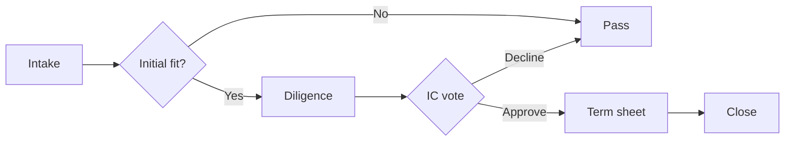

# Demo Investment Memo

This is placeholder content rendered through `@lossless-group/lfm` to verify
that the memo route in `/promote/[slug]/memo` is wired correctly.

### Vimeo Player link
https://player.vimeo.com/video/76979871

### Vimeo Channel link

https://vimeo.com/channels/staffpicks/76979871

### Vimeo Standalone link

https://vimeo.com/76979871

### Vimeo Private/Unlisted link
  
https://vimeo.com/76979871/abc123def4

### YouTube Share link

https://youtu.be/jCe2wg1ulus?si=oplqTdsbv8sv2JfH

## Why now

A short paragraph that would describe the timing thesis of the deal.

### YouTube playlist link

https://youtube.com/playlist?list=PLME9DvdybGUN7PtbmJhSyYcUakt7tAya1&si=SKKEtkemYJ5tpQRO

## Risks

- Risk one
- Risk two
- Risk three

### Youtube short

https://youtube.com/shorts/tkKPG6zXo8E?si=9OcXNmYd7bXWbW7Y

## Terms

| Item | Value |
|------|-------|
| Round | Series _ |
| Valuation | $X M post |
| Min check | $25K |

## Deal flow

A quick visual of how this opportunity moves from intake to commitment — used here to verify Mermaid rendering through `@lossless-group/lfm` + the `MermaidChartDisplay` component.

## Sources

> [!NOTE]
> The full citation system is wired through `@lossless-group/lfm`'s
> `remarkCitations` plugin. When real memos use `[^abc123]` references,
> a Sources list will render at the bottom.
