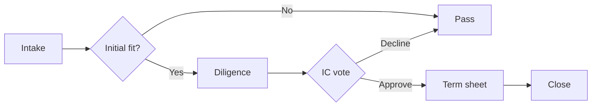

# Demo Investment Memo

This is placeholder content rendered through `@lossless-group/lfm` to verify
that the memo route in `/promote/[slug]/memo` is wired correctly.

### Vimeo Player link
https://player.vimeo.com/video/76979871

### Vimeo Channel link

https://vimeo.com/channels/staffpicks/76979871

### Vimeo Standalone link

https://vimeo.com/76979871

### Vimeo Private/Unlisted link
  
https://vimeo.com/76979871/abc123def4

### YouTube Share link

https://youtu.be/jCe2wg1ulus?si=oplqTdsbv8sv2JfH

## Why now

A short paragraph that would describe the timing thesis of the deal.

### YouTube playlist link

https://youtube.com/playlist?list=PLME9DvdybGUN7PtbmJhSyYcUakt7tAya1&si=SKKEtkemYJ5tpQRO

## Risks

- Risk one
- Risk two
- Risk three

### Youtube short

https://youtube.com/shorts/tkKPG6zXo8E?si=9OcXNmYd7bXWbW7Y

## Terms

| Item | Value |
|------|-------|
| Round | Series _ |
| Valuation | $X M post |
| Min check | $25K |

## Deal flow

A quick visual of how this opportunity moves from intake to commitment — used here to verify Mermaid rendering through `@lossless-group/lfm` + the `MermaidChartDisplay` component.



## Inline links (OG-enriched, popover behavior)

Plain inline links inside prose. When `ogFetch.enabled: true`, the
`remark-og-fetcher` plugin attaches `LinkPreviewData` to each link's
`node.data.linkPreview` so the popover system can render hover cards
without extra fetches at render time.

Stripe's writeup of [the engineering blog post](https://stripe.com/blog/online-payments-acceptance-rate)
is a clean-OG case the `direct` backend handles fine. The
[NYTimes article on AI economics](https://www.nytimes.com/2024/06/26/technology/ai-economy-money-deals.html)
is a Cloudflare-protected case where `direct` typically fails and
`opengraph-io` is needed. The [Wikipedia page on Open Graph protocol](https://en.wikipedia.org/wiki/Open_Graph_protocol)
is a baseline that always returns clean tags.

## Substitution previews (`:::link-preview`)

Single-URL substitutions — the link is replaced in the document flow
with a visual preview component. Spec §4.23.6.

Default form (Article, Card):

:::link-preview
https://stripe.com/blog/online-payments-acceptance-rate
:::

Explicit type and format:

:::link-preview{type="article" format="row"}
https://en.wikipedia.org/wiki/Open_Graph_protocol
:::

Card variant with margin-track positioning:

:::link-preview{type="article" format="card" aside="right-escape"}
https://www.nytimes.com/2024/06/26/technology/ai-economy-money-deals.html
:::

Video as a substitution (instead of bare-URL auto-unfurl) — useful
when the author wants the video framed as a preview card rather than
embedded full-player:

:::link-preview{type="video" format="card"}
https://youtu.be/jCe2wg1ulus
:::

Per-instance class + data attribute (Layer 1 escape hatch):

:::link-preview{type="article" format="card" class="brand-glow" data-track="memo-demo-q2"}
https://stripe.com/blog/online-payments-acceptance-rate
:::

## Multi-URL rollups (`:::link-rollup`)

Multiple URLs grouped into a single component. Children render as the
matching format (Column → Row, Gallery → Card, etc.). Spec §4.23.6.

Column rollup (renders each child as a Row):

:::link-rollup{type="article" format="column"}
https://stripe.com/blog/online-payments-acceptance-rate
https://en.wikipedia.org/wiki/Open_Graph_protocol
https://www.nytimes.com/2024/06/26/technology/ai-economy-money-deals.html
:::

Gallery of videos (renders each child as a Card; columns configurable):

:::link-rollup{type="video" format="gallery" columns=3}
https://youtu.be/jCe2wg1ulus
https://youtube.com/shorts/tkKPG6zXo8E
https://vimeo.com/76979871
:::

Horizontal-scroll thumb row at the bottom of an article ("see also"):

:::link-rollup{type="article" format="thumb-row--horizontal-scroll"}
https://stripe.com/blog/online-payments-acceptance-rate
https://en.wikipedia.org/wiki/Open_Graph_protocol
https://www.nytimes.com/2024/06/26/technology/ai-economy-money-deals.html
:::

## Obsidian portability — code-fence equivalents

Authors editing in Obsidian use code fences with custom lang names.
LFM treats fences whose lang matches a registered directive name as
semantically equivalent to the `:::` form (`remark-code-fence-as-directive`,
forthcoming). Spec §4.23.6 — *Author syntax* / Obsidian-equivalent form.

```link-preview type="article" format="card"
https://stripe.com/blog/online-payments-acceptance-rate
```

```link-rollup type="video" format="gallery" columns=3
https://youtu.be/jCe2wg1ulus
https://youtube.com/shorts/tkKPG6zXo8E
https://vimeo.com/76979871
```

## Sources

> [!NOTE]
> The full citation system is wired through `@lossless-group/lfm`'s
> `remarkCitations` plugin. When real memos use `[^abc123]` references,
> a Sources list will render at the bottom.
