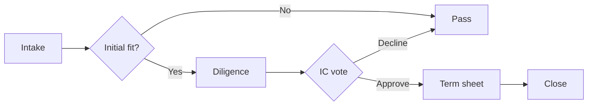

# Demo Investment Memo

This is placeholder content rendered through `@lossless-group/lfm` to verify
that the memo route in `/promote/[slug]/memo` is wired correctly.

### Vimeo Player link
https://player.vimeo.com/video/76979871

### Vimeo Channel link

https://vimeo.com/channels/staffpicks/76979871

### Vimeo Standalone link

https://vimeo.com/76979871

### Vimeo Private/Unlisted link
  
https://vimeo.com/76979871/abc123def4

### YouTube Share link

https://youtu.be/jCe2wg1ulus?si=oplqTdsbv8sv2JfH

## Why now

A short paragraph that would describe the timing thesis of the deal.

### YouTube playlist link

https://youtube.com/playlist?list=PLME9DvdybGUN7PtbmJhSyYcUakt7tAya1&si=SKKEtkemYJ5tpQRO

## Risks

- Risk one
- Risk two
- Risk three

### Youtube short — a note on the video-player journey

The path to a unified video player family started with a simple frustration: every time an author wanted to embed a video, the recipe was different. YouTube had one shape, Vimeo another, Loom a third — and the author had to remember which provider expected which directive, which IDs went where, and which props the component happened to expose. That cognitive tax compounded fast in long-form memos with three or four embeds.

https://youtube.com/shorts/tkKPG6zXo8E?si=9OcXNmYd7bXWbW7Y

So we inverted the principle: the *author* pastes a URL, full stop. The renderer figures out everything else. A bare URL on its own line is enough for `remark-bare-link` to classify the provider, extract the ID, and dispatch to the right component — `YouTubeEmbed` for full videos, `YouTubeShortsEmbed` for 9:16 vertical content, `YouTubePlaylistEmbed` for `?list=` URLs, `VimeoEmbed` for everything Vimeo. One catalog, one regex pass, one dispatch.

The Shorts case turned out to be interesting precisely because it has a different aspect ratio than every other YouTube embed — 9:16 vertical instead of 16:9 horizontal. That single geometric fact ruled out a "smart" hybrid component that would branch internally. Better to give Shorts its own dedicated home, optimized for the medium: max-width 320, vertical wrapper, lazy-loaded iframe.

But once the Shorts component looked good in isolation, a second observation surfaced: at 320px wide, it doesn't *need* to be isolated. A vertical card at that width fits comfortably in a margin-track-style float, with prose flowing along its long edge. So the default rendering for a Shorts URL is now an `<aside>` with `float: right` — text continues to its left, the way a magazine pull-quote would sit next to the column. Authors who want it on the other side get there via an `align` parameter; mobile viewports drop the float and re-center.

The same line of thinking extends out to playlists. A playlist URL today auto-unfurls into something visually identical to a single video — same chrome, same aspect, same affordances. That's the next gap on the list, and the new spec at `context-v/specs/Versatile-Component-Library-for-Video-Players.md` codifies what "playlist-aware" actually means: a header strip with title and item count, sidebar visibility rules tied to viewport width, and theme-token chrome that reads as a *bundle* rather than a single player.

### Directive form — when the prose calls for the other side

Bare URLs always pick the default float side, which today is right. But sometimes the surrounding prose argues for the opposite — a left-aligned card, with the text running to its right. That's where the directive form earns its keep. Same component, same dispatch graph, just a syntax surface that can carry an attribute the bare URL can't. The author shouldn't have to extract the video ID by hand to use it, either — pasting the same URL they already had inside the container is the realistic authoring move:

:::youtube-short{align="left"}
https://youtube.com/shorts/tkKPG6zXo8E?si=9OcXNmYd7bXWbW7Y
:::

The S→T→C model says the difference between this rendering and the one above is the *Syntax* the author wrote — the *Trigger* and the *Component* are unchanged. `remark-directive` parses the `:::youtube-short` container into a `containerDirective` MDAST node with `attributes.align` set; GFM auto-links the URL inside the container into a paragraph with a single `link` child; the renderer's directive dispatch picks the directive up by name, walks its children for the bare-URL paragraph if no `id`/`url` attribute was given, and hands `url` plus `align` through to the same component the bare-URL path mounts. No new plugin, no new component, no new dispatch path. Just one more arm on the existing tree, plus one fallback that reads the body content the way an author actually writes it.

What this gets us as authors: the option to flip the float side per-instance, in-place, without leaving the markdown. Useful when a section's main visual rhythm wants the card on the opposite side from the previous section, or when a particular paragraph reads better with text running rightward instead of leftward. Most of the time the default is right; the override exists for the moments when it isn't.

The same syntax surface is going to host every per-instance video-component override we add — `start` time for full videos, `index` for playlists, `mute` and `autoplay` for hero embeds, `aside` overrides for inline-substitution cards. The pattern stays the same: bare URL when the defaults are good enough, directive form when they aren't. Authors graduate from one to the other when they need to, and not before.

## Terms

| Item | Value |
|------|-------|
| Round | Series _ |
| Valuation | $X M post |
| Min check | $25K |

## Deal flow

A quick visual of how this opportunity moves from intake to commitment — used here to verify Mermaid rendering through `@lossless-group/lfm` + the `MermaidChartDisplay` component.



## Inline links (OG-enriched, popover behavior)

Plain inline links inside prose. When `ogFetch.enabled: true`, the
`remark-og-fetcher` plugin attaches `LinkPreviewData` to each link's
`node.data.linkPreview` so the popover system can render hover cards
without extra fetches at render time.

Stripe's writeup of [the engineering blog post](https://stripe.com/blog/online-payments-acceptance-rate)
is a clean-OG case the `direct` backend handles fine. The
[NYTimes article on AI economics](https://www.nytimes.com/2024/06/26/technology/ai-economy-money-deals.html)
is a Cloudflare-protected case where `direct` typically fails and
`opengraph-io` is needed. The [Wikipedia page on Open Graph protocol](https://en.wikipedia.org/wiki/Open_Graph_protocol)
is a baseline that always returns clean tags.

## Substitution previews (`:::link-preview`)

Single-URL substitutions — the link is replaced in the document flow
with a visual preview component. Spec §4.23.6.

Default form (Article, Card):

:::link-preview
https://stripe.com/blog/online-payments-acceptance-rate
:::

Explicit type and format:

:::link-preview{type="article" format="row"}
https://en.wikipedia.org/wiki/Open_Graph_protocol
:::

Card variant with margin-track positioning:

:::link-preview{type="article" format="card" aside="right-escape"}
https://www.nytimes.com/2024/06/26/technology/ai-economy-money-deals.html
:::

Video as a substitution (instead of bare-URL auto-unfurl) — useful
when the author wants the video framed as a preview card rather than
embedded full-player:

:::link-preview{type="video" format="card"}
https://youtu.be/jCe2wg1ulus
:::

Per-instance class + data attribute (Layer 1 escape hatch):

:::link-preview{type="article" format="card" class="brand-glow" data-track="memo-demo-q2"}
https://stripe.com/blog/online-payments-acceptance-rate
:::

## Multi-URL rollups (`:::link-rollup`)

Multiple URLs grouped into a single component. Children render as the
matching format (Column → Row, Gallery → Card, etc.). Spec §4.23.6.

Column rollup (renders each child as a Row):

:::link-rollup{type="article" format="column"}
https://stripe.com/blog/online-payments-acceptance-rate
https://en.wikipedia.org/wiki/Open_Graph_protocol
https://www.nytimes.com/2024/06/26/technology/ai-economy-money-deals.html
:::

Gallery of videos (renders each child as a Card; columns configurable):

:::link-rollup{type="video" format="gallery" columns=3}
https://youtu.be/jCe2wg1ulus
https://youtube.com/shorts/tkKPG6zXo8E
https://vimeo.com/76979871
:::

Horizontal-scroll thumb row at the bottom of an article ("see also"):

:::link-rollup{type="article" format="thumb-row--horizontal-scroll"}
https://stripe.com/blog/online-payments-acceptance-rate
https://en.wikipedia.org/wiki/Open_Graph_protocol
https://www.nytimes.com/2024/06/26/technology/ai-economy-money-deals.html
:::

## Obsidian portability — code-fence equivalents

Authors editing in Obsidian use code fences with custom lang names.
LFM treats fences whose lang matches a registered directive name as
semantically equivalent to the `:::` form (`remark-code-fence-as-directive`,
forthcoming). Spec §4.23.6 — *Author syntax* / Obsidian-equivalent form.

```link-preview type="article" format="card"
https://stripe.com/blog/online-payments-acceptance-rate
```

```link-rollup type="video" format="gallery" columns=3
https://youtu.be/jCe2wg1ulus
https://youtube.com/shorts/tkKPG6zXo8E
https://vimeo.com/76979871
```

## Sources

> [!NOTE]
> The full citation system is wired through `@lossless-group/lfm`'s
> `remarkCitations` plugin. When real memos use `[^abc123]` references,
> a Sources list will render at the bottom.
